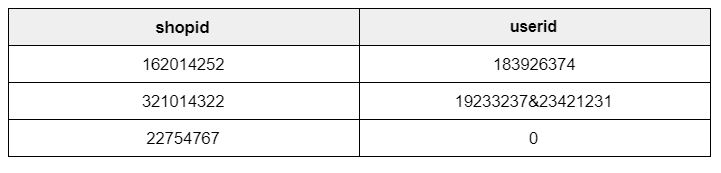

# SHOPEE CODE LEAGUE - ORDER BRUSHING

## Order Brushing Detection

Perilaku pengguna yang tidak normal pada platform e-commerce dapat dideteksi dengan berbagai cara. Misalnya, jika suatu barang di toko adalah *best seller* tetapi banyak dari pesanannya berasal dari pembeli yang sama, kami memiliki alasan untuk mencurigai bahwa penjual tersebut melakukan *brush* terhadap pesanan. *Order Brushing* adalah teknik yang dapat digunakan oleh penjual untuk membuat pesanan palsu untuk meningkatkan peringkat penjual atau item tertentu, yang mungkin mendorong item penjual tersebut meningkatkan hasil pencarian di Shopee. Untuk menjaga integritas pengalaman belanja online kami, kami secara konsisten memantau dan menandai setiap kasus pesanan yang mungkin terjadi pada Shopee.

## Task

1. Identifikasi semua toko yang dianggap telah melakukan *order brush*
2. Untuk setiap toko yang diidentifikasi telah melakukan *order brush*, identifikasi pembeli yang diduga telah melakukan *order brush* untuk toko itu.

Untuk keperluan pertanyaan ini, toko-toko dianggap telah melakukan *order brush* jika tingkat konsentratnya lebih besar dari atau sama dengan 3 pada setiap contoh. Untuk keperluan pertanyaan ini, pembeli yang mencurigakan dianggap sebagai pembeli yang memberikan kontribusi pesanan tertinggi ke toko yang dianggap telah melakukan *brush* terhadap pesanan. Untuk perhitungan proporsi tertinggi pesanan ke toko , hanya sertakan pesanan yang terjadi dalam kasus ketika pesanan *brush* telah dianggap telah terjadi. Dalam kasus di mana banyak pengguna berbagi proporsi pesanan tertinggi yang sama untuk toko tertentu, semua pengguna tersebut dianggap sebagai pembeli yang mencurigakan.

## Basic Concepts

1. orderid mewakili transaksi berbeda pada Shopee
2. shopid adalah id penjual di Shopee
3. Userid adalah id pembeli di Shopee
4. Event Time merupakan waktu transaksi dilakukan pada Shopee

## Submission Format

Periksa setiap toko dan tentukan apakah dianggap telah melakukan *order brush*. Jika sebuah toko melakukan *order brush*, daftarkan userid yang dianggap mencurigakan untuk shopid yang bersangkutan.

Diperlukan dua kolom:

1. shopid
2. userid

- Jika toko tidak dianggap telah melakukan *order brush*, tetapkan nilai 0
- Lain-lain, daftarkan userid yang dianggap mencurigakan untuk shopid yang bersangkutan
- Jika ada lebih dari 1 userid diidentifikasi sebagai mencurigakan, daftarkan semua userids dipisahkan oleh "&", dengan userid numerik yang lebih kecil terlebih dahulu.

 Hasil yang didapatkan harus memiliki 18770 baris (tidak termasuk tajuk), masing-masing dengan 2 kolom. 

# My Results

- solution.csv

# 
  &copy; Asep Saputra  

